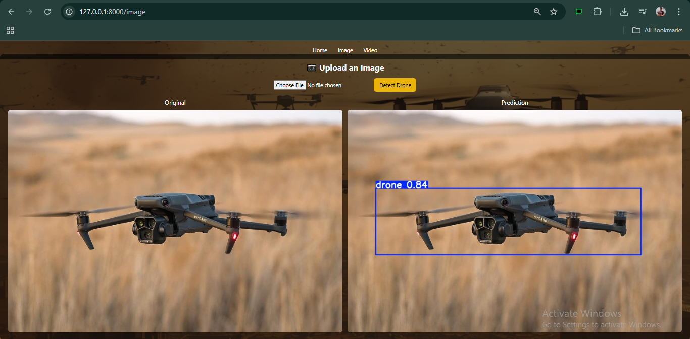

# 🚁 Drone Detection System

A real-time Drone Detection application powered by YOLOv11, built with FastAPI and a modern web interface. Upload images or videos to detect drones with high accuracy using a custom-trained Deep Learning model.

[](https://www.python.org/downloads/)
[](https://fastapi.tiangolo.com/)
[](https://github.com/ultralytics/ultralytics)

---

## 🎯 Overview

This project implements an end-to-end drone detection system using YOLOv11 (nano) architecture. The model was trained on a custom drone detection dataset and deployed as a web application with an intuitive interface for real-time detection on both images and videos.

**Key Highlights:**
- ✅ **94.3% mAP@50** on validation set
- ✅ **57.5% mAP@50-95** for precise localization
- ✅ **Real-time inference** (~10-20ms per frame)
- ✅ **Web-based deployment** with FastAPI
- ✅ **Support for both images and videos**

---

## ✨ Features

- 🖼️ **Image Detection**: Upload images and get instant drone detection results
- 🎥 **Video Detection**: Process entire videos with frame-by-frame analysis
- 🚀 **Fast Inference**: Optimized YOLOv11n model for real-time performance
- 🎨 **Modern UI**: Clean, responsive interface built with Tailwind CSS
- 📊 **Side-by-Side Comparison**: View original and predicted outputs simultaneously
- 🔄 **Automatic Conversion**: AVI to MP4 conversion for browser compatibility
- 💾 **Result Storage**: Automatic saving of processed files

---

## 🎬 Demo

### Application Interface

<p align="center">
  
  <br/>
  <em>Landing Page</em>
</p>

<p align="center">
  
  <br/>
  <em>Image Detection Interface</em>
</p>

<p align="center">
  
  <br/>
  <em>Image Detection Result</em>
</p>

<p align="center">
  
  <br/>
  <em>Video Detection Interface</em>
</p>

<p align="center">
  
  <br/>
  <em>Video Detection Result</em>
</p>

### Sample Detection Output

https://github.com/adeel-iqbal/drone-detection-yolo/assets/drone_detection_vid.mp4

*Model successfully detecting drones in various scenarios with bounding boxes*

### Application Walkthrough

https://github.com/adeel-iqbal/drone-detection-yolo/assets/app_vid.mp4

*Complete demonstration of the web application workflow*

---

## 📊 Model Performance

The YOLOv11n model was trained for 50 epochs on a custom drone dataset:

| Metric | Value |
|--------|-------|
| **Precision** | 94.6% |
| **Recall** | 90.4% |
| **mAP@50** | 94.3% |
| **mAP@50-95** | 57.5% |
| **Inference Speed** | ~10-20ms/frame (T4 GPU) |
| **Model Size** | 5.5MB |
| **Parameters** | 2.59M |

**Training Details:**
- Dataset: 1,012 training images, 347 validation images
- Architecture: YOLOv11n (nano)
- Input Size: 640x640
- Batch Size: 16
- Optimizer: AdamW (lr=0.002)
- Hardware: Tesla T4 GPU (Google Colab)

---

## 🛠️ Installation

### Prerequisites

- Python 3.8+
- FFmpeg (for video conversion)
- Git

### Step 1: Clone the Repository

```bash
git clone https://github.com/adeel-iqbal/drone-detection-yolo.git
cd drone-detection-yolo
```

### Step 2: Install Dependencies

```bash
pip install -r requirements.txt
```

### Step 3: Install FFmpeg

**Ubuntu/Debian:**
```bash
sudo apt update
sudo apt install ffmpeg
```

**macOS:**
```bash
brew install ffmpeg
```

**Windows:**
Download from [ffmpeg.org](https://ffmpeg.org/download.html) and add to PATH

### Step 4: Download the Model

Place your trained `best.pt` model file in the `models/` directory. If you don't have a trained model, you can:
- Train your own using `drone_detection.ipynb`
- Download from the releases page (if available)

---

## 🚀 Usage

### Running the Application

```bash
uvicorn app:app --reload
```

The application will be available at `http://localhost:8000`

### Using the Web Interface

1. **Home Page**: Navigate to the landing page
2. **Image Detection**:
   - Click "Image" in the navbar
   - Upload an image file
   - Click "Detect Drone"
   - View original and predicted images side-by-side
3. **Video Detection**:
   - Click "Video" in the navbar
   - Upload a video file
   - Click "Detect Drone"
   - View original and processed videos with detections

### API Usage

You can also interact with the API programmatically:

```python
import requests

# Image detection
with open('drone_image.jpg', 'rb') as f:
    response = requests.post('http://localhost:8000/image', files={'file': f})

# Video detection
with open('drone_video.mp4', 'rb') as f:
    response = requests.post('http://localhost:8000/video', files={'file': f})
```

---

## 📁 Project Structure

```
drone-detection-yolo/
│
├── app.py                          # FastAPI application
├── models/
│   └── best.pt                     # Trained YOLOv11 model
│
├── static/
│   ├── uploads/                    # User uploads and predictions
│   │   └── preds/                  # Processed outputs
│   └── images/                     # Background images
│       └── wp_drone.jpg
│
├── templates/
│   ├── base.html                   # Base template with navbar
│   ├── index.html                  # Landing page
│   ├── image.html                  # Image detection page
│   └── video.html                  # Video detection page
│
├── assets/                         # Documentation assets
│   ├── preview1.png
│   ├── preview2.png
│   ├── preview3.png
│   ├── preview4.png
│   ├── preview5.png
│   ├── drone_detection_vid.mp4
│   └── app_vid.mp4
│
├── drone_detection.ipynb           # Model training notebook
├── requirements.txt                # Python dependencies
└── README.md                       # Project documentation
```

---

## 💻 Technology Stack

### Backend
- **FastAPI**: Modern, fast web framework for building APIs
- **Ultralytics YOLOv11**: State-of-the-art object detection
- **OpenCV**: Video processing
- **FFmpeg**: Video format conversion

### Frontend
- **Jinja2**: Template engine
- **Tailwind CSS**: Utility-first CSS framework
- **Font Awesome**: Icon library

### Machine Learning
- **PyTorch**: Deep learning framework
- **YOLOv11n**: Efficient nano model architecture
- **Albumentations**: Image augmentation

---

## 📚 Dataset

The model was trained on a custom drone detection dataset from Kaggle:

- **Source**: [YOLO Drone Detection Dataset](https://www.kaggle.com/datasets/muki2003/yolo-drone-detection-dataset)
- **Format**: YOLO format with annotations
- **Training Images**: 1,012
- **Validation Images**: 347
- **Classes**: 1 (drone)

### Data Augmentation

Training included the following augmentations:
- Horizontal flipping (50%)
- HSV color jittering
- Random blur and median blur
- Grayscale conversion
- CLAHE (Contrast Limited Adaptive Histogram Equalization)

---

## 🎓 Training

The model training process is documented in `drone_detection.ipynb`. Key steps:

### 1. Environment Setup
```python
!pip install ultralytics
```

### 2. Dataset Preparation
```python
!kaggle datasets download -d muki2003/yolo-drone-detection-dataset
```

### 3. Model Training
```python
from ultralytics import YOLO

model = YOLO("yolo11n.pt")
model.train(
    data="drone_dataset/data.yaml",
    epochs=50,
    imgsz=640,
    batch=16
)
```

### 4. Evaluation
```python
results = model.val()
```

### Training Configuration

```yaml
names:
  - drone
nc: 1
path: /content/drone_dataset
train: /content/drone_dataset/train
val: /content/drone_dataset/val
```

---

## 🔌 API Endpoints

### GET `/`
Landing page

**Response**: HTML page

---

### GET `/image`
Image detection page

**Response**: HTML page with upload form

---

### POST `/image`
Process uploaded image

**Parameters**:
- `file` (multipart/form-data): Image file

**Response**: HTML page with original and predicted images

---

### GET `/video`
Video detection page

**Response**: HTML page with upload form

---

### POST `/video`
Process uploaded video

**Parameters**:
- `file` (multipart/form-data): Video file

**Response**: HTML page with original and processed videos

---

## 🤝 Contributing

Contributions are welcome! Please follow these steps:

1. Fork the repository
2. Create a feature branch (`git checkout -b feature/AmazingFeature`)
3. Commit your changes (`git commit -m 'Add some AmazingFeature'`)
4. Push to the branch (`git push origin feature/AmazingFeature`)
5. Open a Pull Request

---

## 👨‍💻 Contact

**Adeel Iqbal**

- Email: [adeelmemon096@yahoo.com](mailto:adeelmemon096@yahoo.com)
- LinkedIn: [linkedin.com/in/adeeliqbalmemon](https://www.linkedin.com/in/adeeliqbalmemon)
- GitHub: [github.com/adeel-iqbal](https://github.com/adeel-iqbal)
- Project Link: [https://github.com/adeel-iqbal/drone-detection-yolo](https://github.com/adeel-iqbal/drone-detection-yolo)

---

## 🙏 Acknowledgments

- [Ultralytics](https://github.com/ultralytics/ultralytics) for the YOLOv11 implementation
- [Kaggle](https://www.kaggle.com/) for hosting the dataset
- [FastAPI](https://fastapi.tiangolo.com/) for the excellent web framework
- [Tailwind CSS](https://tailwindcss.com/) for the styling framework

---

<p align="center">
  Made with ❤️ by Adeel Iqbal
</p>
